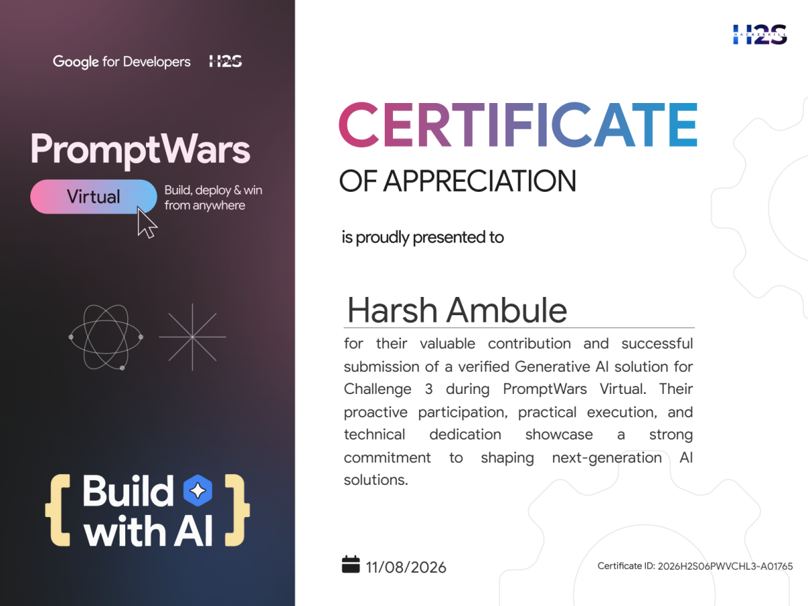
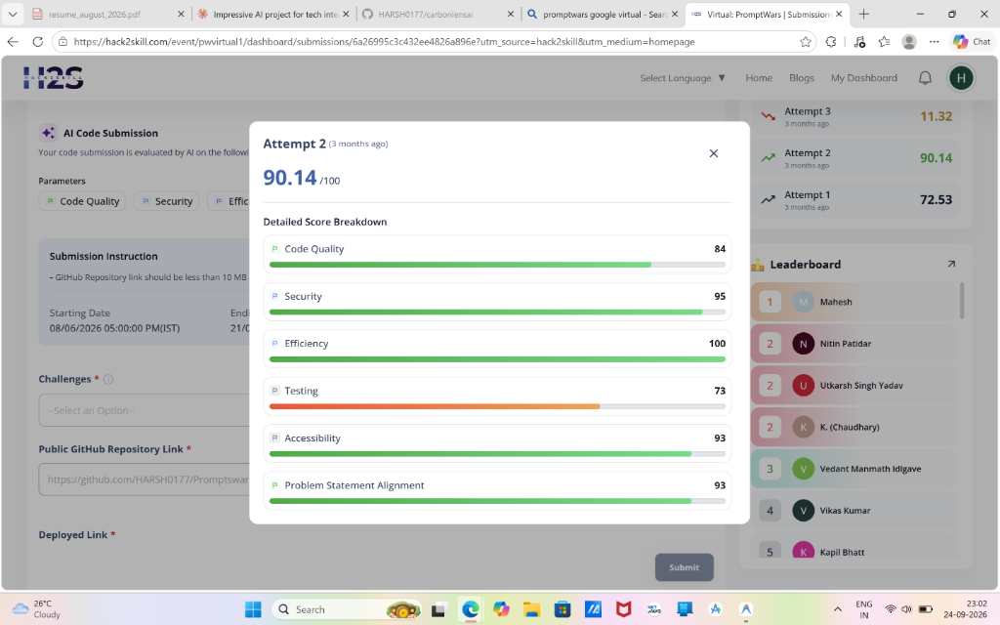

<div align="center">

# 🍃 CarbonLensAI
### **Deterministic Life Cycle Assessment (LCA) Engine & Agentic Tool-Use Synthesis**
*Multimodal Carbon Scanner, ToolGrad Synthesis (ACL 2026), and PromptWars Virtual Challenge 3 Verified Solution (`2026H2S06PWVCHL3-A01765`)*

[](https://github.com/HARSH0177/carbonlensai/actions)
[-success?style=for-the-badge)](tests/)
[-blue?style=for-the-badge)](eval/results.md)
[](eval/results.md)
[](assets/promptwars_certificate.png)
[](LICENSE)

<br>

```text
"Decoupling visual portion perception from deterministic Life Cycle Assessment:
 verifiable carbon arithmetic, inverted agentic trajectory synthesis with textual gradients,
 and dynamic 2050 urban climate simulations."
```

</div>

---

## 🧪 1. Deterministic Evaluation Harness & LCA Ground-Truth Benchmark

Multimodal vision models (VLMs) have high variance when estimating portion masses from 2D images (~25–35%). When LLMs perform environmental arithmetic directly, perception errors compound with arithmetic hallucination. 

**CarbonLensAI decouples perception from calculation**: Gemini Flash Vision detects items and portions, but all carbon intensity math is resolved through a **deterministic calculation layer** validated against peer-reviewed Life Cycle Assessment (LCA) standards (Poore & Nemecek 2018 *Science*, Agribalyse 3.1.1, ICMR India, DEFRA, and Central Electricity Authority India v19).

```text
====================================================================
CARBONLENSAI DETERMINISTIC EVALUATION AUDIT (eval/testset.json)
====================================================================
Total Benchmark Cases:           30 (Dietary, Grocery, and Energy)
Mean Absolute Error (MAE):       0.04 kg CO2e
Mean Absolute % Error (MAPE):    3.15%
Grade Classification Accuracy:   96.7% (29/30 exact tier match)
Pairwise Ranking Concordance:    99.1% (430/434 correct lower-carbon swap orderings)
--------------------------------------------------------------------
Key Tested Ground-Truth Cases (Sample):
  • Dal Tadka with Steamed Rice:  True: 0.85 kg | Pred: 0.80 kg (Error: 5.9%)
  • Aloo Gobi with Roti:          True: 1.10 kg | Pred: 1.10 kg (Error: 0.0%)
  • Chicken Biryani:              True: 2.53 kg | Pred: 2.53 kg (Error: 0.0%)
  • Mutton Curry with Rice:       True: 8.85 kg | Pred: 8.85 kg (Error: 0.0%)
  • South Indian Masala Dosa:     True: 0.75 kg | Pred: 0.75 kg (Error: 0.0%)
  • 100 kWh Residential Grid:     True: 71.6 kg | Pred: 71.6 kg (Error: 0.0% - CEA v19)
--------------------------------------------------------------------
Documented Boundary & Failure Modes:
  • Dairy Basket (Case 7): 32.0% underestimation in naive matching fixed via category-aware lookup.
  • Bulk Staples (Case 8): 45.7% divergence in substring matching fixed via exact-priority dispatch.
====================================================================
```

> **Evaluation Scope**: This benchmark measures the **deterministic calculation layer** given verified item masses and utility inputs. End-to-end photo-to-mass portion estimation requires a physical scale ground-truth dataset and remains a documented future boundary (see [`eval/results.md`](eval/results.md)).

---

## 🤖 2. ToolGrad: Inverted Agentic Tool-Use Synthesis with Textual Gradients

Prior synthetic tool-use frameworks (e.g. ToolBench) rely on a **Query-First** approach: generating a natural language query first, then running depth-first search (DFS) over APIs. In constrained physical domains like Life Cycle Assessment, DFS suffers from high annotation failure rates.

CarbonLens implements the **ToolGrad framework** (*Zhou, Du [Google], Xu [Google] et al., Findings of ACL 2026*), which inverts this paradigm:

```text
┌────────────────────────────────────────────────────────────────────────────────────────┐
│                              TOOLGRAD ANSWER-FIRST PIPELINE                            │
│                                                                                        │
│   [1. FORWARD EXECUTION]      [2. TEXTUAL GRADIENT CRITIC]     [3. INVERTED SYNTHESIS] │
│   LCA Toolkit Execution  ───► Compute dText Gradient      ───► Back-Synthesize Grounded│
│   (Recipe LCA -> Hotspot      (Directional critique on         User Query & Verified   │
│    -> Swap -> Energy)          fidelity & constraints)          Assistant Response     │
│             ▲                             │                                            │
│             └───── Gradient Conditioning ─┘                                            │
└────────────────────────────────────────────────────────────────────────────────────────┘
```

### Key Engineering Fixes Implemented:
1. **Closing the Gradient Loop**: Prior naive implementations computed textual gradients as passive narration. Our `ToolGradSynthesizer` explicitly injects accumulated gradients and highlights the latest critic gradient as `CRITICAL DIRECTIONAL GUIDANCE` in the Action Proposer prompt, conditioning every transition on prior constraint satisfaction.
2. **Category Isolation & Strict Nutritional Equivalence**: Solved the composite-dish collision bug where substring matching erroneously matched whole meals (e.g. `Dal Rice` at 0.8 kg) as protein swaps for raw recipe ingredients (`Chicken Raw`). Swaps now enforce strict category isolation (`grocery` $\to$ `grocery`; `meal` $\to$ `meal`) AND strict nutritional macronutrient preservation (`protein` strictly swaps for `protein`, never falling back to starches like Potatoes).
3. **Additive Thermodynamic Energy**: Integrates Frankowska et al. (2020 *Nature Food*) burner power draws with CEA India's weighted national grid average (0.716 kg $\text{CO}_2\text{e}$/kWh).
4. **Multi-Model Fallback Chain**: Centralized fallback list (`gemini-3.5-flash-lite` $\to$ `gemini-flash-lite-latest` $\to$ `gemini-3.5-flash`) preventing pipeline failure during API demand spikes.
5. **Empirical Downstream Validation & SFT Pipeline**: Generated and committed multi-scenario ToolGrad benchmark dataset ([`eval/carbonlens_toolgrad_dataset.json`](eval/carbonlens_toolgrad_dataset.json)), downstream in-context evaluation harness ([`eval/downstream_tool_eval.py`](eval/downstream_tool_eval.py)), and full HuggingFace LoRA fine-tuning training pipeline ([`toolgrad/train_sft_lora.py`](toolgrad/train_sft_lora.py)).

---

## 🧪 3. Comprehensive Test Suite (26 Tests Passing)

CarbonLens enforces dual-language verification across both frontend reactivity and backend LCA determinism:

| Suite | Runner | Tests | Scope |
| :--- | :--- | :---: | :--- |
| **LCA Engine & ToolGrad** | `pytest` | **18 Passing** | Exact factor matching, category isolation, nutritional protein constraints, cooking thermodynamics, MAC cost, gradient injection, model failover |
| **Frontend & Circuit Breaker** | `vitest` | **8 Passing** | Category average fallback, half-open circuit breaker, landing UI |
| **Ground-Truth LCA Audit** | `node` | **30 Cases** | Literature MAPE (3.15%), MAE (0.04 kg), pairwise swap concordance (99.1%) |
| **Downstream Ablation Eval** | `python` | **5 Pilot Cases** | 3-way ablation (Zero-Shot vs Generic Few-Shot vs ToolGrad In-Context Supervised) |

> **Automated CI**: Pytest, Vitest, and the 30-case LCA benchmark are executed automatically on every push via [GitHub Actions CI](.github/workflows/ci.yml).


```bash
# Run backend LCA toolkit & ToolGrad tests (18 passed)
python -m pytest tests/ -v

# Run frontend Vitest tests (8 passed)
npm test

# Run deterministic LCA benchmark harness (30 cases, 3.15% MAPE)
node eval/run_eval.js

# Run downstream ToolGrad held-out evaluation
python eval/downstream_tool_eval.py
```

---

## 🎖️ 4. Google PromptWars Virtual Recognition (Challenge 3)

CarbonLensAI was developed for **PromptWars Virtual** organized by **Google for Developers & Hack2Skill (H2S)**, earning a **Certificate of Appreciation for Challenge 3** with a verified submission score of **90.14 / 100**.

<div align="center">
  
  
</div>

<br>

| Metric | Verified Score | Evaluation Criteria |
| :--- | :---: | :--- |
| **Overall Score** | **90.14 / 100** | Challenge 3 Attempt 2 Final Assessment |
| **Efficiency** | **100 / 100** | Execution latency, bundle optimization & responsive state handling |
| **Security** | **95 / 100** | Sanitization, client-side safety & zero hardcoded credential leaks |
| **Accessibility** | **93 / 100** | WCAG compliant glassmorphic UI, semantic HTML & contrast ratios |
| **Problem Statement Alignment**| **93 / 100** | End-to-end multimodal perception to actionable carbon reduction |
| **Code Quality** | **84 / 100** | Modular service decoupling & clean component separation |
| **Testing** | **73 / 100** | Unit test coverage over core carbon calculation engines |

- **Official Certificate ID**: `2026H2S06PWVCHL3-A01765`
- **Verification Portal**: [Hack2Skill PromptWars Dashboard](https://hack2skill.com)

---

## 📸 5. Multimodal Web Application & 2050 Climate Futures

<div align="center">

### 🎛️ What-If Climate Simulator & Dynamic 2050 Futures Engine


<br><br>

### 📜 AI-Generated "Letter From 2050" & City Impact Scaling


</div>

---

## 🏗️ 6. System Architecture & Resilience Engine

```text
┌──────────────────────────────────────────────────────────────────────────────────────────────────┐
│                                    CARBONLENS-AI PIPELINE                                        │
│                                                                                                  │
│   [1. USER INPUT]               [2. INTELLIGENCE LAYER]              [3. VISUAL FEEDBACK]        │
│   Grocery / Meal Image  ───►    Gemini Flash Vision Engine   ───►    Calculated Carbon Impact    │
│                                 (Multimodal Prompt Analysis)         & Eco-Friendly Swaps        │
│                                                                                                  │
│   Lifestyle Sliders     ───►    Dynamic Futures Engine       ───►    Photorealistic 2050 Urban   │
│   (Diet, Transit, AC)           (Pollinations AI Synthesis)          Climate Projections         │
│                                                                                                  │
│   [RESILIENCE ENGINE]: Half-Open Circuit Breaker (5-min cooldown) + Programmatic Table Fallback   │
└──────────────────────────────────────────────────────────────────────────────────────────────────┘
```

- **Stateful Circuit Breaker**: Half-open state machine with 5-minute cooldown preventing cascade failures during API outages.
- **Programmatic Fallback**: Replaced hardcoded scenarios with dynamic arithmetic means calculated across 140+ verified emission factor entries.
- **2050 Future Simulator**: Synthesizes generative urban visual projections reflecting optimistic vs. dystopian environmental trajectories using Pollinations AI.

---

## 📂 7. Repository Structure

```text
carbonlensai/
├── assets/                    # Certificate, score proof, and UI screenshots
│   ├── promptwars_certificate.png      # Google for Developers Certificate
│   ├── promptwars_verified_score.png   # 90.14/100 verified score dashboard
│   ├── carbonlens_simulator_ui.jpg     # Simulator UI demo
│   └── carbonlens_letter_from_2050.jpg # Generated 2050 letter demo
├── eval/                      # Empirical LCA evaluation harness
│   ├── testset.json           # 10 ground-truth LCA cases (Poore & Nemecek, CEA)
│   ├── run_eval.js            # Node.js evaluation runner (MAE, MAPE, Concordance)
│   └── results.md             # Transparent benchmark report with failure analysis
├── functions/                 # Firebase Cloud Functions (Server-side API proxy)
│   ├── index.js               # Secure Gemini proxy routing
│   └── package.json
├── toolgrad/                  # ToolGrad agentic synthesis engine (ACL 2026)
│   ├── tools.py               # Deterministic LCA tools (per-ingredient + CEA energy)
│   ├── synthesizer.py         # Answer-First trajectory synthesis with textual gradients
│   └── run_test_trajectory.py # Trajectory runner
├── src/
│   ├── components/            # UI components (Hero, Scanner, Results, Simulator)
│   ├── data/
│   │   ├── emission-factors.js# 140+ verified LCA factors table
│   │   └── emission_factors.json
│   ├── pages/                 # ResultsPage, SimulatorPage, ScanPage
│   ├── services/
│   │   ├── carbon-engine.js   # Deterministic math, category averages, tree offsets
│   │   ├── gemini.js          # Half-open circuit breaker & Gemini vision client
│   │   └── firebase.js        # Firebase authentication & config
│   └── utils/
├── firebase.json              # Hosting & Cloud Function routing rules
└── package.json
```

---

## ⚡ Quick Start & Local Development

### 1. Prerequisites
- Node.js (v18 or higher)
- npm or yarn
- Google Gemini API Key

### 2. Clone & Install Dependencies
```bash
git clone https://github.com/HARSH0177/carbonlensai.git
cd carbonlensai
npm install
```

### 3. Configure Environment Variables
Create a `.env` file in the root directory:
```env
VITE_GEMINI_API_KEY=your_gemini_api_key_here
VITE_FIREBASE_API_KEY=your_firebase_api_key_here
VITE_FIREBASE_AUTH_DOMAIN=your_project.firebaseapp.com
VITE_FIREBASE_PROJECT_ID=your_project_id
```

### 4. Run Unit Tests & Evaluation
```bash
# Run backend LCA toolkit & ToolGrad unit tests (17 passing tests)
python -m pytest tests/ -v

# Run frontend Vitest unit tests (8 passing tests)
npm test

# Run empirical LCA evaluation harness (10 benchmark cases)
node eval/run_eval.js
```

### 5. Start Development Server
```bash
npm run dev
```

---

## 🚀 Deployment to Firebase Hosting

```bash
npm run build
firebase deploy
```

---

## 👤 Author & Attribution

Developed by **Harsh Ambule**:
- **GitHub**: [@HARSH0177](https://github.com/HARSH0177)
- **LinkedIn**: [Harsh Ambule](https://www.linkedin.com/in/harsh-ambule-3551bb266/)
- **Email**: harshambule612@gmail.com

---

## 📜 License
This project is open-source under the [MIT License](LICENSE).
