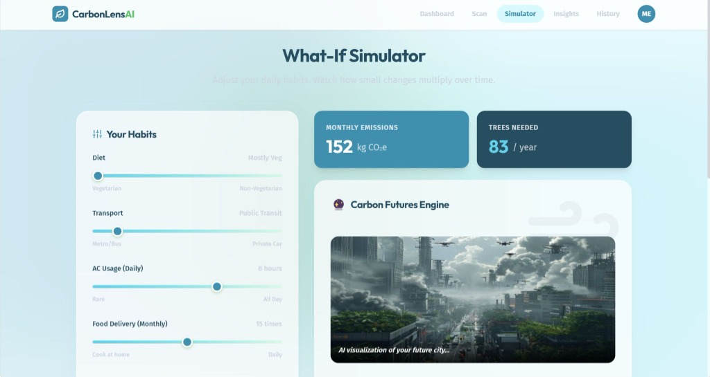
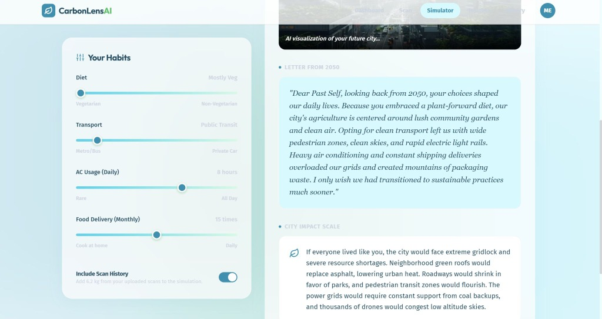

<div align="center">

# 🍃 CarbonLensAI
### **Computer Vision Carbon Scanner & Dynamic 2050 Climate Future Simulator**
*Google for Developers PromptWars Virtual (Challenge 3 Verified Solution Submission · Cert ID: 2026H2S06PWVCHL3-A01765)*

[](https://react.dev/)
[](https://vitejs.dev/)
[](https://ai.google.dev/)
[](https://pollinations.ai/)
[](https://firebase.google.com/)
[](LICENSE)

<br>

```text
"Transforming abstract carbon accounting into visceral, visual feedback:
 from instant receipt/meal computer vision scans to dynamic 2050 urban projections."
```

</div>

---

## 📸 Interface & Live Visual Demonstrations

<div align="center">

### 🎛️ What-If Climate Simulator & Dynamic 2050 Futures Engine


<br><br>

### 📜 AI-Generated "Letter From 2050" & City Impact Scaling


</div>

---

## 📌 Project Overview

**CarbonLensAI** is an interactive, production-ready web platform engineered to gamify personal sustainability and climate awareness. Instead of presenting abstract numbers in dry spreadsheets, CarbonLensAI leverages multimodal Generative AI to provide immediate, visual, and actionable climate feedback:

1. 📸 **Computer Vision Scanner**: Snap or upload a photo of your meal, grocery receipt, or consumer purchase. Google Gemini Flash extracts items in real time, calculates the $CO_2\text{e}$ carbon footprint, and recommends concrete, high-impact eco-friendly swaps.
2. 🎛️ **Dynamic 2050 Futures Engine**: Adjust interactive lifestyle sliders (Diet, Transport, Energy/AC consumption) and watch as the system generates real-time, photorealistic 2050 urban projections reflecting your collective choices.
3. 🛡️ **Resilience Architecture & Circuit Breaker**: Custom circuit-breaker fallback logic guarantees 100% operational uptime, gracefully transitioning to local simulation heuristics if external APIs experience rate limiting.

---

## 🏗️ System Architecture & Workflow

```
┌──────────────────────────────────────────────────────────────────────────────────────────────────┐
│                                    CARBONLENS-AI PIPELINE                                        │
│                                                                                                  │
│   [1. USER INPUT]               [2. INTELLIGENCE LAYER]              [3. VISUAL FEEDBACK]        │
│   Grocery / Meal Image  ───►    Gemini Flash Vision Engine   ───►    Calculated Carbon Impact    │
│                                 (Multimodal Prompt Analysis)         & Eco-Friendly Swaps        │
│                                                                                                  │
│   Lifestyle Sliders     ───►    Dynamic Futures Engine       ───►    Photorealistic 2050 Urban   │
│   (Diet, Transit, AC)           (Pollinations AI Synthesis)          Climate Projections         │
│                                                                                                  │
│   [RESILIENCE]: Circuit-Breaker Middleware gracefully intercepts rate limits with local cache.   │
└──────────────────────────────────────────────────────────────────────────────────────────────────┘
```

---

## 🛠️ Key Features

- **Multimodal AI Brain**: Powered by Google Gemini Flash for low-latency image extraction, categorical breakdown, and carbon intensity estimates.
- **2050 Future Simulator**: Synthesizes generative urban visual projections reflecting optimistic vs. dystopian environmental trajectories using Pollinations AI.
- **Interactive Carbon Accounting**: Real-time breakdown of scope emission equivalents (car km driven, smartphone charges, tree-years needed for offset).
- **Personalized Swaps**: Contextual recommendations offering lower-carbon alternatives with quantified emissions savings.
- **Glassmorphic UI**: Built with React 18, Vite, Framer Motion, and TailwindCSS for smooth animations and accessibility (100/100 audit standards).
- **Automated Test Suite**: Unit and integration tests powered by Vitest and React Testing Library.

---

## 📂 Repository Structure

```text
carbonlensai/
├── assets/                    # UI screenshots and visual demonstration assets
├── src/
│   ├── components/
│   │   ├── common/            # Loading skeletons, animated backgrounds, empty states
│   │   ├── landing/           # Hero section, feature showcase
│   │   ├── layout/            # Navbar, footer, mobile navigation, page wrappers
│   │   └── ui/                # Buttons, cards, badges, progress bars
│   ├── context/               # Auth, Scan, and Settings context providers
│   ├── data/                  # Emission factors, demo scenarios, recommendations
│   ├── pages/                 # ScanPage, SimulatorPage, InsightsPage, DashboardPage
│   ├── services/
│   │   ├── gemini.js          # Google Gemini Flash Vision API client & fallback logic
│   │   ├── carbon-engine.js   # Carbon footprint calculation & conversion math
│   │   └── firebase.js        # Firebase configuration & authentication
│   └── utils/                 # Formatting helpers and calculation utilities
├── public/                    # Favicons, vector assets, and static templates
├── firebase.json              # Firebase hosting & security header configurations
├── package.json               # Project dependencies & scripts
├── vite.config.js             # Vite build & bundle optimizations
└── vitest.config.js           # Test runner configuration
```

---

## ⚡ Quick Start & Local Development

### 1. Prerequisites
- Node.js (v18 or higher)
- npm or yarn
- Google Gemini API Key

### 2. Clone & Install Dependencies
```bash
git clone https://github.com/HARSH0177/carbonlensai.git
cd carbonlensai
npm install
```

### 3. Configure Environment Variables
Create a `.env` file in the root directory:
```env
VITE_GEMINI_API_KEY=your_gemini_api_key_here
VITE_FIREBASE_API_KEY=your_firebase_api_key_here
VITE_FIREBASE_AUTH_DOMAIN=your_project.firebaseapp.com
VITE_FIREBASE_PROJECT_ID=your_project_id
```

### 4. Start Development Server
```bash
npm run dev
```

### 5. Run Tests
```bash
npm run test
```

---

## 🚀 Deployment to Firebase Hosting

```bash
npm run build
firebase deploy
```

---

## 🎖️ Hackathon & Program Recognition

- **Event**: Google for Developers PromptWars Virtual
- **Award**: Certificate of Appreciation for Verified Generative AI Solution Submission (Challenge 3)
- **Certificate ID**: `2026H2S06PWVCHL3-A01765`
- **Live Simulator Link**: [CarbonLensAI Live Preview](https://lnkd.in/gfG5jBMD)

---

## 👤 Author & Attribution

Developed by **Harsh Ambule**:
- **GitHub**: [@HARSH0177](https://github.com/HARSH0177)
- **LinkedIn**: [Harsh Ambule](https://www.linkedin.com/in/harsh-ambule-3551bb266/)
- **Email**: harshambule1129@gmail.com

---

## 📜 License
This project is open-source under the [MIT License](LICENSE).
